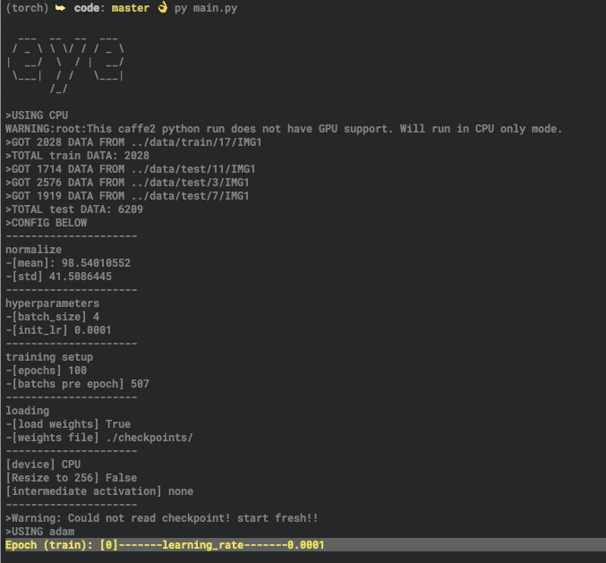
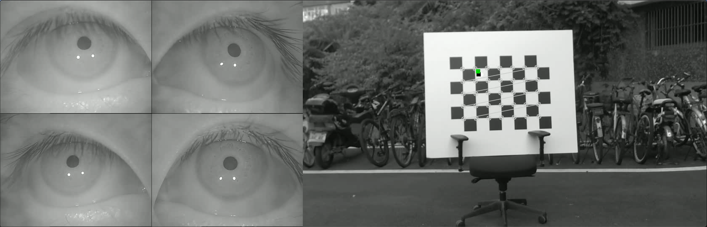
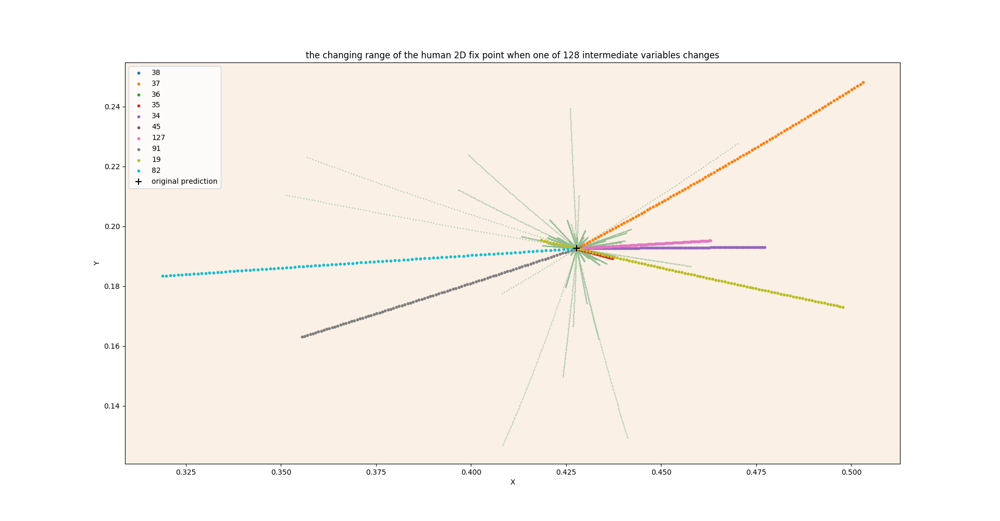

## Explain the eye-tracking model

[TOC]
### introduction

(Chinese)

我们希望可以找到一种理解神经网络的方法, 可以理解在网络中重要的特征有哪些, 以及在尽可能保证模型表现的情况下, 我们根据此解释性对模型可以进行怎样的优化

如今的卷积神经网络中大多结构为

1. 设计特征提取器, 使用卷积神经网络$Conv Net$来获取 feature map $f$
2. 将 $f$  向量化得到$embedding_{f}$ , 输入到全连接层$FCNet$中进行回归或者预测

在一个已经训练好的模型中, 由$f$ 得来的$embedding_{f}$ 可以作为输入图片的 低维表征(embedding), 或者说, 是图片信息中与目标输出相关的 低维表征. 如在眼球跟踪中, $embedding_f$ 中的信息应该与凝视点有关.

但是网络中提取出来的$embedding_f$ 中都是有用的信息吗?  往往神经网络架构师仅仅被模型在预测上的表现主导, 往往对模型本身的容量利用程度(名词待定)没有明确的认识,

> Clearly, when it is possible to mimic the function learned by a complex model with a small net, the function learned by the complex model wasn’t truly too complex to be learned by a small net. This suggests to us that the complexity of a learned model, and the size and architecture of the representation best used to learn that model, are different things... [5]

我们希望可以直观的解释, 网络中哪些计算路径是真正影响结果的, 而另外的一些则对最后的输出影响不大, 这些信息可以指导研究人员构造一个容量更合理更小的网络来达到相似的目标.

但是, 仅仅缩小网络进行训练往往得不到与容量更大的模型相近的精度, 往往需要与模型蒸馏的方法结合. 

> Surprisingly, often it is not (yet) possible to train a small neural net on the original training data to be as accurate as the complex model, nor as accurate as the mimic model. Compression demonstrates that a small neural net could, in principle, learn the more accurate function, but current learning algorithms are unable to train a model with that accuracy from the original training data; instead, we must train the complex intermediate model first and then train the neural net to mimic it...[5]

而现在的模型蒸馏或压缩往往集中于卷积层的优化, 而对于全连接层的优化较少. 但事实上, 除了极深的一些网络(如 ResNet, VGG)外, 一个 5-10 层的卷积网络中, 往往卷积层参数数量与对应的全连接分类层的参数数量都是十分大的. 如本次实验所使用的模型

- 一个卷积网络对应的所有参数为 85560, 模型中所使用的四个网络参数总量为 342240
- 而对应的全连接层, 仅仅是第一层, 将摊平(flatten)的特征图转化成 128 维向量, 就有 1089536 参数
- 上述这些皆是可训练的参数, 如果仅从参数量来说, 全连接层这一块是值得压缩的


### developing environment

* macOS Mojave version 10.14
* Python 3.6.3
* pytorch 1.0.0 or higher
* torchvision0.4.0a0+6b959ee


### model

*  Refer to part of iTracker feaure extractor from [CSALI MIT](https://github.com/CSAILVision/GazeCapture)


### install

* `pip install requirements.txt`
* **prepare data**

under `root` 

```bash
mkdir data && cd data
mkdir train && mkdir test
```

copy data following the paths

```bash
data
├── val
|		├── 17
|   ├── 20
|   ├── etc
├── test
│   ├── 3
│   ├── 7
│   └── etc
└── train
    ├── 8
    ├── 9
    └── etc
```

* `cd code && python main.py`

* follow the error traceback and see what's going on 😁

* There are some launch command examples:

  * `python main.py --doload=no --tensorboard=yes --lr=5e-4 --sigmoid=yes --opt=adam --delta=0.005 --tag="L2_adam_0.0005"`

  * `python main.py --doload=yes --eval=yes --weights="./checkpoints/best_L2_adam_0.0005checkpoint_sigmoid.pth-2.tar" --evalFolder=22 --sigmoid=yes`


### TODO

* pytorch's data format problems--solved

```python
# File "main.py"
m = m.float()
# File "utils.py", Function 'train' and 'validate'
output = model(data["img0"].float(), data["img1"].float(), data["img2"].float(), data["img3"].float())
```

maybe there are some more elegant way to do so.

- running on GPU platform--solved 
- HOW TO EXPLAIN?


### log

* 2019.8.22: complete `load_data.py` , return  `dict` type data. 

  including keys:

  * `img0`(left eye 0),`img1`(left eye 1), `im2`(right eye 3), `img3`(right eye 4) , image data format is `CHW`(channel first) ,shape`(-1, 1, 576, 720)`, type `torch.Tensor`
  * `label` , gaze point in image coordinate , type `torch.Tensor`
*  2019.8.23: add some image normalize tools  by [dearmrlv](https://github.com/dearmrlv)

* 2019.8.24: complete pipeline, and run it on CPU device



* 2019.8.25: successfully running on GPU and add more options

```shell
eye-tracker-model.

optional arguments:
  -h, --help            show this help message and exit
  --tensorboard TENSORBOARD
                        ask if store the output to tensorboard
  --comment COMMENT
  --batch_size BATCH_SIZE
  --doload DOLOAD       load previous weights or not
  --weights WEIGHTS     weight file location
  --epochs EPOCHS       traing total epochs
  --lr LR               base learning rate
  --opt OPT             choose optimizer in [adam, SGD]
  --sigmoid SIGMOID     use simoid activation function in the last layer or
                        not
  --delta DELTA         Tolerance for early stoping
  --tag TAG             suffix of the weight file
  --eval EVAL           start eval mode
  --evalFolder EVALFOLDER
                        choose a test folder to generate prediction
  --resize RESIZE       resize picture to 256X256 (original 576X720)
  --generating GENERATING
                        generating the gradient heat map over the origin image
  --collect COLLECT     collect the intermediate embedding to middle.npy
  --activation ACTIVATION
                        choose the activation function to generate
                        intermediate embedding
```

* 2019.8.30: Trained a bunch of models, for now, best predicting error on test set is about **10 pixels**, still working on it🤯



(green for prediction, black for ground truth. use demo.py to generate video)

* add vis tools and experiment model to analyze




