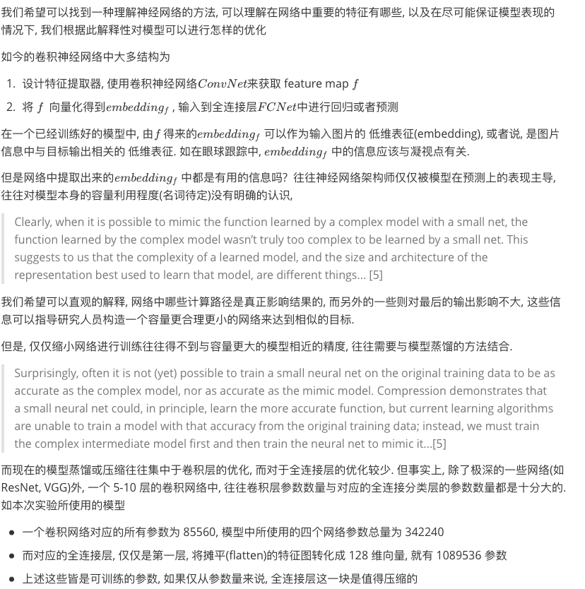

## Explain the eye-tracking model

[TOC]
### introduction

(Chinese)



 

### developing environment

* macOS Mojave version 10.14
* Python 3.6.3
* pytorch 1.0.0 or higher
* torchvision0.4.0a0+6b959ee


### model

*  Refer to part of iTracker feaure extractor from [CSALI MIT](https://github.com/CSAILVision/GazeCapture)


### install

* `pip install requirements.txt`
* **prepare data**

under `root` 

```bash
mkdir data && cd data
mkdir train && mkdir test
```

copy data following the paths

```bash
data
├── val
|		├── 17
|   ├── 20
|   ├── etc
├── test
│   ├── 3
│   ├── 7
│   └── etc
└── train
    ├── 8
    ├── 9
    └── etc
```

* `cd code && python main.py`

* follow the error traceback and see what's going on 😁

* There are some launch command examples:

  * `python main.py --doload=no --tensorboard=yes --lr=5e-4 --sigmoid=yes --opt=adam --delta=0.005 --tag="L2_adam_0.0005"`

  * `python main.py --doload=yes --eval=yes --weights="./checkpoints/best_L2_adam_0.0005checkpoint_sigmoid.pth-2.tar" --evalFolder=22 --sigmoid=yes`


### TODO

* pytorch's data format problems--solved

```python
# File "main.py"
m = m.float()
# File "utils.py", Function 'train' and 'validate'
output = model(data["img0"].float(), data["img1"].float(), data["img2"].float(), data["img3"].float())
```

maybe there are some more elegant way to do so.

- running on GPU platform--solved 
- HOW TO EXPLAIN?


### log

* 2019.8.22: complete `load_data.py` , return  `dict` type data. 

  including keys:

  * `img0`(left eye 0),`img1`(left eye 1), `im2`(right eye 3), `img3`(right eye 4) , image data format is `CHW`(channel first) ,shape`(-1, 1, 576, 720)`, type `torch.Tensor`
  * `label` , gaze point in image coordinate , type `torch.Tensor`
*  2019.8.23: add some image normalize tools  by [dearmrlv](https://github.com/dearmrlv)

* 2019.8.24: complete pipeline, and run it on CPU device


* 2019.8.25: successfully running on GPU and add more options

```shell
eye-tracker-model.

optional arguments:
  -h, --help            show this help message and exit
  --tensorboard TENSORBOARD
                        ask if store the output to tensorboard
  --comment COMMENT
  --batch_size BATCH_SIZE
  --doload DOLOAD       load previous weights or not
  --weights WEIGHTS     weight file location
  --epochs EPOCHS       traing total epochs
  --lr LR               base learning rate
  --opt OPT             choose optimizer in [adam, SGD]
  --sigmoid SIGMOID     use simoid activation function in the last layer or
                        not
  --delta DELTA         Tolerance for early stoping
  --tag TAG             suffix of the weight file
  --eval EVAL           start eval mode
  --evalFolder EVALFOLDER
                        choose a test folder to generate prediction
  --resize RESIZE       resize picture to 256X256 (original 576X720)
  --generating GENERATING
                        generating the gradient heat map over the origin image
  --collect COLLECT     collect the intermediate embedding to middle.npy
  --activation ACTIVATION
                        choose the activation function to generate
                        intermediate embedding
```

* 2019.8.30: Trained a bunch of models, for now, best predicting error on test set is about **10 pixels**, still working on it🤯


(green for prediction, black for ground truth. use demo.py to generate video)

* add vis tools and experiment model to analyze


